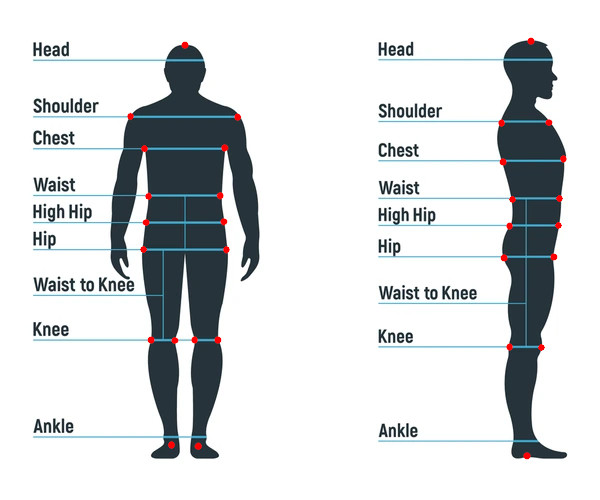

# Human Body Measurement - Model Training Guide

This guide outlines the steps to train keypoints detection and regression models for human body measurement using Detectron2. The process is divided into two main parts: training the keypoints model and training the regression model to predict body measurements.

## Part 1: Keypoint Detection Model Training

### Preparation

#### Installation
1. **Clone Detectron2**:
   - Run the command `git clone https://github.com/facebookresearch/detectron2`.
   - Follow the installation instructions provided in the repository.
   - paste the contents of the provided human_body_measurement_scripts.zip file in cloned detectron2 project folder

#### Splitting Data
2. **Organize Images**:
   - Divide your front and side pose images into separate directories.

#### Data Preparation Script
3. **Modify Script Paths**:
   - Open `my_scripts/prepare_data_for_tagging.py`.
   - Modify the input and output directory paths for both the front and side pose image directories.
   - This preprocessed data will be used for annotating images.

#### Image Tagging
4. **Tagging Images**:
   - Use the VGG Image Annotator tool to tag images for keypoints. Access the tool at [VGG Annotator Tool](https://www.robots.ox.ac.uk/~vgg/software/via/via_demo.html). Refer to the video tutorial.
   - After tagging, export the annotations as a CSV file.
   - Reference how images to be tagged. (ignore the knee part)
   - 

#### Prepare Training Data
5. **Set Up Training Data**:
   - Modify `my_scripts/keypoints/prepare_keypoints_data.sh` with the following paths:
     - `csv_file_path`: Path to the exported CSV file.
     - `json_file_path`: Destination path for the generated JSON file.
     - `images_folder_path`: Path to the directory containing pose images.
     - `output_mask_folder_path`: Destination path for saved masks.
     - `input_backgrounds_folder`: Path to background images' directory.
     - `output_augmented_dir`: Path where augmented data will be saved.
     - `num_augs`: Total number of images to be generated (train + val).

6. **Cross-Check Images**:
   - Run `python my_scripts/keypoints/overlay_keypoints.py`. This will overlay the keypoints on the images, allowing you to visually inspect and verify their correctness.

### Training

#### Configuration and Execution
7. **Configure Training Parameters**:
   - Modify the paths and parameters in `train.py` as follows:
     - `pose_name`: Specify 'front' or 'side'.
     - `train_name`: Name to register the training dataset.
     - `val_name`: Name to register the validation dataset.
     - `train_json_path`: Path to the training JSON.
     - `val_json_path`: Path to the validation JSON.
     - `train_data_dir`: Directory containing training images.
     - `val_data_dir`: Directory containing validation images.
     - `cfg.SOLVER.IMS_PER_BATCH`: Batch size (adjust based on GPU memory).
     - `cfg.SOLVER.CHECKPOINT_PERIOD`: Frequency of saving checkpoints.
     - `cfg.SOLVER.MAX_ITER`: Number of training iterations.
     - `cfg.OUTPUT_DIR`: Path to save the trained model.

#### Start Training
8. **Start the Model Training**:
   - Execute the command `python train.py` to start the training process.

#### Inference
9. **Run the Model**:
   - Execute the command `python inference.py` to infer on images.
     - `cfg.DATASETS.TRAIN`: Provide train_name which was registered while training. 
     - `cfg.DATASETS.TEST`: Provide val_name which was registered while training. 
     - `cfg.OUTPUT_DIR`: Provide model output_dir.
     - `cfg.MODEL.WEIGHTS`: Which model iter to load.
     - `cfg.MODEL.DEVICE`: Whether to run on cpu or gpu.

## Part 2: Regression Model Training for Body Measurements

### Data Preparation for Regression
a) **Create Augmented Data**:
   - Run `python my_scripts/regression/create_regression_augmented_data.py` to create augmented data for training the regression model. Generate csv for front and side poses.
   - Parameters to modify include:
     - `cfg` (same as inference in Part 1)
     - `pose_name`: 'front' or 'side'
     - `vis_image`: Set to True for visualization.
     - `imagePaths`, `output_csv_path`, `dest_vis_folder`: Modify according to your dataset paths.
   
b) **Combine Data**:
   - After generating CSVs for front and side poses, run `my_scripts/regression/combine_data.py` to generate the final CSV for regression training.

### Training Regression Model
c) **Train the Regression Model**:
   - Modify the paths in `my_scripts/regression/regression.py` and run it to train the regression model.

### Application Setup
d) **Setup Application**:
   - Modify model paths and images path in `app.py` to fetch body measurements from images.
